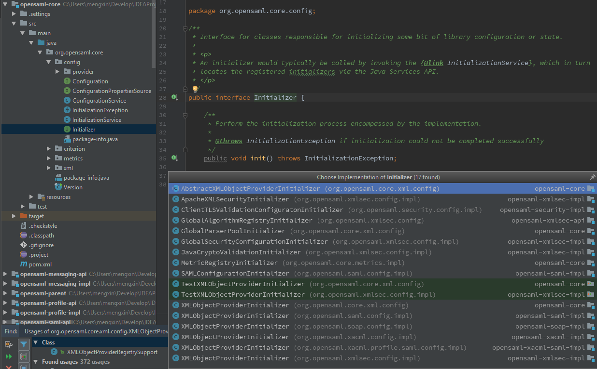
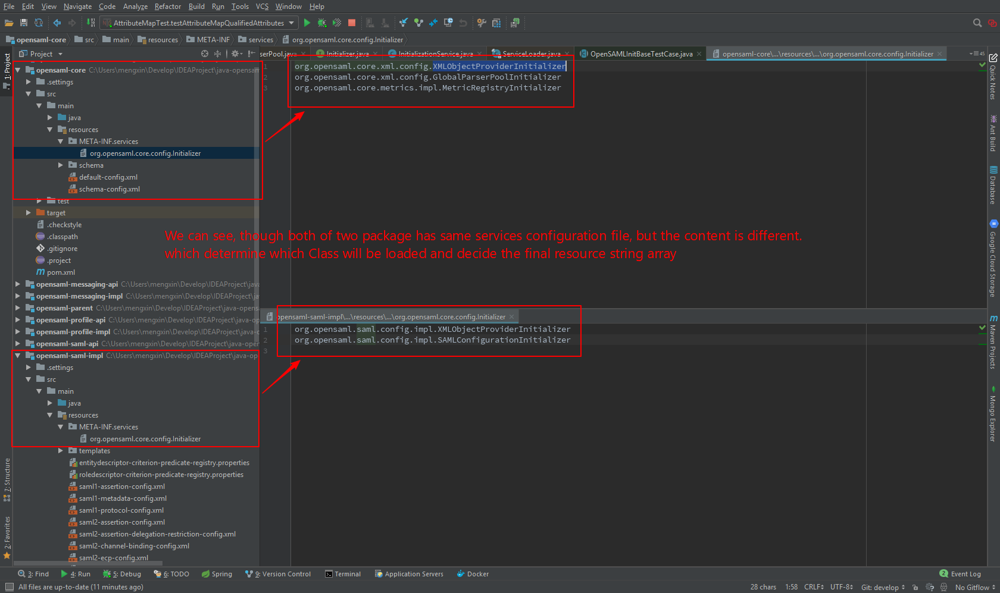
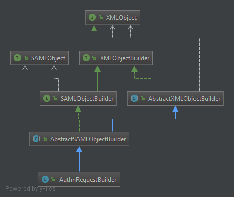

## SSO-OpenSAML初始化源码分析

摘要：本文详细介绍 `OpenSAML` 初始化过程，通过源码以及相关理论知识理解初始化过程的原理。并且理论联系实践，将初始化分析应用于使用和扩展中。

<!--more-->

# 概述

对于 `OpenSAML` 开源软件包从 V2 到 V3，都始终保持着初始化的操作。这个动作是使用 `OpenSAML` 的基础，只有执行了该操作才能够访问 `OpenSAML` 提供的根据标准预定义的构造器（Builder），XML序列化工具（Marshal）和反序列化工具 （UnMarshal）。 使用中，初始化过程十分简单，只需要一个静态方法就可以：

```
InitializationService.initialize();
```

但这个静态方法背后做了很多工作，`OpenSAML` 依赖于很多的配置文件的集合，同时也预定义了很多默认的配置文件，这些文件都是根据众多的标准来实现的。默认的配置一般适用于大多数的标准情形，但是 `OpenSAML` 同样提供扩展机制，使用者可以自由添加订制的配置。但是无论如何，这个初始化工作（包括默认的配置和自定义的配置）必须在使用 `OpenSAML` 之前完成。

如果这个操作忘记执行，那么在尝试使用 `OpenSAML` 的时候，将会抛出异常 `NullPointerException`。初次使用`OpenSAML` 需要时刻注意。通过研究`OpenSAML` 的单元测试可以发现，它使用 `OpenSAMLInitBaseTestCase` 基类和 `TestNG` 的 `@BeforeSuite` 来保证每个测试集合执行之前，初始化工作都是被执行的。^[A Guide to OpenSAML V3 (P27) PARTII Chapter 2 The OpenSAML Initialization process ]

# SPI 原理简介

在开始进行源码分析之前，首先简要介绍 `SPI` 的原理。

SPI 全称为 (`Service Provider Interface`) ,是JDK内置的一种服务提供发现机制， 目前有不少框架用它来做服务的扩展发现， 简单来说，它就是一种动态替换发现的机制， 举个例子来说， 有个接口，想运行时动态的给它添加实现，你只需要添加一个实现。

请参考另外[一篇博文](https://notes.mengxin.science/2018/07/07/learning-sso-opensaml-initializer-analysis/TODO)，根据 `JDK` 官方的文档介绍如何使用 `SPI`。

`OpemSAML` 从第二版开始就是使用 `SPI` 来加载配置文件的，这个加载过程也是`OpenSAML` 初始化过程的重要的一部分。

可以参考 [OpemSAML 官方wiki原文](https://wiki.shibboleth.net/confluence/display/OS30/Initialization+and+Configuration)，以及这篇[简要的翻译和分析](https://notes.mengxin.science/2018/07/07/learning-sso-opensaml-initializer-analysis/TODO)。

# 初始化过程分析

首先一切从 `InitializationService.initialize();` 该方法开始。

## `SPI` 加载 `Initializer` 实现类

该静态方法就是使用 `SPI` 加载 `Initializer` 的实现类，我们首先来看 `Initializer` 接口，这个接口就是 `SPI` 中的 `I`，也就是 `Interface`。通过下图可以看到该接口的所有实现类：



### `SPI` 加载代码

这些实现类将通过 `SPI` 机制加载进来，同时 `Initializer` 只有一个方法，那就是`init()`，在实现类加载进来后，就依次执行该方法，具体代码如下：

```java
final ServiceLoader<Initializer> serviceLoader = getServiceLoader();
final Iterator<Initializer> iter = serviceLoader.iterator();
while (iter.hasNext()) {
	final Initializer initializer  = iter.next();
	log.debug("Initializing module initializer implementation: {}", initializer.getClass().getName());
	try {
		initializer.init();
	} catch (final InitializationException e) {
		log.error("Error initializing module", e);
		throw e;
	}
}
```

### `SPI` 加载配置

SPI 另外一个关键的配置就是需要在资源文件夹中配置需要加载的实现类的全名。路径为： `resources/META-INF.services`。 我们可以在 `opensaml-core` 中找到该文件 `resources/META-INF/services/org.opensaml.core.config.Initializer`。文件内容如下：

```
org.opensaml.core.xml.config.XMLObjectProviderInitializer
org.opensaml.core.xml.config.GlobalParserPoolInitializer
org.opensaml.core.metrics.impl.MetricRegistryInitializer
```

这时候就有一个问题，前面我们看到 `Initializer` 有那么多实现类，这里为什么只有3个？ 这里由于 `OpenSAML` Version 3 将整个工具包进行了逻辑上的分割，这里可以参考另一篇文章 [OpenSAML整体概述](https://notes.mengxin.science/2018/07/07/learning-sso-opensaml-initializer-analysis/TODO)。然后每个独立模块都有自己独立的`SPI`配置文件，这样使用者是需要加载自己依赖的模块的配置。

上面看到的三个实现类的配置是在 `core` 模块中配置的，我们可以再看一下另一个重要 `saml` 模块中的配置文件 `\java-opensaml\opensaml-saml-impl\src\main\resources\META-INF\services\org.opensaml.core.config.Initializer`：

```
org.opensaml.saml.config.impl.XMLObjectProviderInitializer
org.opensaml.saml.config.impl.SAMLConfigurationInitializer
```

[](https://www.github.com/xmeng1/images/raw/master/images/201871-diffrent-package-SPI-different.png)

另外我们还需要注意一点，`SPI` 的配置是可以累加的，比如我们可以看到 `core` 模块中为了测试 `SPI` 机制，同样也定义了一个配置文件: `\java-opensaml\opensaml-core\src\test\resources\META-INF\services\org.opensaml.core.config.Initializer`。通过执行测试用例 `InitializationServiceTest`，发现这些配置的实现类也同样会被加载 （一共加载了4个实现类），所以这里 `SPI` 的配置是可以在包内叠加的。

## 配置资源加载机制

理解了 `SPI` 机制之后，我们就可以具体分析接口的具体实现类的加载过程了。这个实现类基本在每一个包对应的实现包（后缀为`impl`）都有，我们选取两个对照的来介绍：一个为 `core` 包里的 `org.opensaml.core.xml.config.XMLObjectProviderInitializer`， 另一个选取核心的 `saml` 包里的 `org.opensaml.saml.config.impl.XMLObjectProviderInitializer`。理解了这两个类的加载过程，基本就理解了整个 `OpenSAML` 加载的原理。

### 类结构分析

这里所有的实现类都继承了一个抽象类`AbstractXMLObjectProviderInitializer`，而且所有实现类都覆盖了抽象类的 `protected String[] getConfigResources()`，而基本没有覆盖其他方法。也就是说，不同的实现类对应加载不同的资源配置文件，而初始化的过程是统一，也就是处理资源配置文件的过程是一致，都是在抽象类中的 `init()` 方法中完成。

对于配置文件是什么，目前只需要知道它是一个 `xml` 文件，用于定义不同的 `XML` 对象的构造、序列化、反序列等所对应的实体类。

### init()函数分析

这个函数是`OpenSAML` 初始化时候的必经之路，官方 `JavaDoc`:

> Perform the initialization process encompassed by the implementation

下面是具体的源码：

```java
public void init() throws InitializationException {
	try {
		final XMLConfigurator configurator = new XMLConfigurator();
		// Checkstyle: FinalLocalVariable OFF
		for (String resource : getConfigResources()) {
		// Checkstyle: FinalLocalVariable ON
			// When using ClassLoader.getResourceAsStream() (as below), resource names should *not*
			// begin with leading "/".  They are always absolute.
			// This differs from Class.getResourceAsStream(), where absolute names must begin with /, otherwise
			// are treated as relative.
			// Checkstyle: ModifiedControlVariable OFF
			if (resource.startsWith("/")) {
				resource = resource.substring(1);
			}
			// Checkstyle: ModifiedControlVariable ON
			log.debug("Loading XMLObject provider configuration from resource '{}'", resource);
			final InputStream is = Thread.currentThread().getContextClassLoader().getResourceAsStream(resource);
			if (is != null) {
				configurator.load(is);
			} else {
				throw new XMLConfigurationException("Resource not found");
			}
		}
	} catch (final XMLConfigurationException e) {
		log.error("Problem loading configuration resource", e);
		throw new InitializationException("Problem loading configuration resource", e);
	}
}
```

通过这部分源码我们可以看到，初始化过程主要有两步：

1. 创建一个 `XMLConfigurator` 的实例, `configurator`
2. 遍历读取资源文件，并以`InputStream` 形式传入 `configurator.load()`，完成资源加载。

这里根据注释还能学习到一个知识：`Class.getResourceAsStream()` 和 `ClassLoader.getResourceAsStream()` 的不同，前者的路径需要在文件前加前缀 `/`，而后者是不能加的。所以这里使用`ClassLoader`，如果检测到资源文件名的第一个字符是 `/` 就移除。这也给我们一个启示，在加载资源文件的时候，可以对传入的文件名进行一些预处理，提高兼容性。（之前总是因为忘记加 `/`，导致找不到资源）

下面我们详细介绍这两个步骤都做了什么。

### XMLConfigurator 实例化过程

虽然代码直接简单的 `new` 了一个 `XMLConfigurator` 对象实例，但是其构造方法还是比较复杂的，全部的源码如下：

```java
public XMLConfigurator() throws XMLConfigurationException {
	parserPool = new BasicParserPool();
	final SchemaFactory factory = SchemaFactory.newInstance(javax.xml.XMLConstants.W3C_XML_SCHEMA_NS_URI);
	final Source schemaSource =
			new StreamSource(XMLConfigurator.class.getResourceAsStream(XMLTOOLING_SCHEMA_LOCATION));
	try {
		configurationSchema = factory.newSchema(schemaSource);

		parserPool.setIgnoreComments(true);
		parserPool.setIgnoreElementContentWhitespace(true);
		parserPool.setSchema(configurationSchema);
		parserPool.initialize();
	} catch (final SAXException e) {
		throw new XMLConfigurationException("Unable to read XMLTooling configuration schema", e);
	} catch (final ComponentInitializationException e) {
		throw new XMLConfigurationException("Unable to initialize parser pool", e);
	}

	synchronized (ConfigurationService.class) {
		XMLObjectProviderRegistry reg = ConfigurationService.get(XMLObjectProviderRegistry.class);
		if (reg == null) {
			log.debug("XMLObjectProviderRegistry did not exist in ConfigurationService, will be created");
			reg = new XMLObjectProviderRegistry();
			ConfigurationService.register(XMLObjectProviderRegistry.class, reg);
		}
		registry = reg;
	}
}
```

#### XML 的解析验证器初始化

首先是实例化 `BasicParserPool` 对象，并赋值给私有的成员变量。该对象是用于读取和验证资源文件的配置的，实际上就是最终的 `XML` 文件的解析器和验证器。

```
parserPool = new BasicParserPool();
```

然后是通过工厂方法来创建用于验证器使用的验证模式 `Schema` 的实力 `configurationSchema`，在 `XML` 的世界里，标准十分重要，任何一个标签都需要标准化定义。

```java
final SchemaFactory factory = SchemaFactory.newInstance(javax.xml.XMLConstants.W3C_XML_SCHEMA_NS_URI);
final Source schemaSource =
new StreamSource(XMLConfigurator.class.getResourceAsStream(XMLTOOLING_SCHEMA_LOCATION));
configurationSchema = factory.newSchema(schemaSource);
```

该验证模式需要配置到 `BasicParserPool` 中，然后初始化 `BasicParserPool`：

```java
parserPool.setIgnoreComments(true);
parserPool.setIgnoreElementContentWhitespace(true);
parserPool.setSchema(configurationSchema);
parserPool.initialize();
```

#### XMLObjectProviderRegistry 初始化

这里就是 `XMLConfigurator` 初始化关键步骤，通过这一步我们就能知道追溯到初始化配置的最终存储的位置，直觉上这里肯定有个一个全局的静态变量储存这些信息。下面我们来一探究竟。

##### 读取 XMLObjectProviderRegistry

首先就是读取当前的 `XMLObjectProviderRegistry`，对于这个读取过程，可以通过 `InitializationServiceTest.java` 单元测试用例来学习。

```java
XMLObjectProviderRegistry reg = ConfigurationService.get(XMLObjectProviderRegistry.class);
```

这里引入了 `ConfigurationService`，

> A service which provides for the registration, retrieval and deregistration of objects related to library module configuration.
> The service uses an internally-managed instance of Configuration to handle the registration, retrieval and deregistration of the configuration objects under its management.
> The service first attempts to use the Java Services API to resolve the instance of Configuration to use. If multiple implementations of Configuration are registered via the Services API mechanism, the first one returned by the ServiceLoader iterator is used. If no Configuration implementation is declared or resolvable using the Services API, then it uses the default implementation MapBasedConfiguration.
> The Configuration instance to use may also be set externally via setConfiguration(Configuration). This may be useful where an application-specific means such as Spring is used to configure the environment. This overrides the resolution process described above.

这个 `get` 方法的相关源码如下：

```java
public static <T extends Object> T get(@Nonnull final Class<T> configClass) {
	final String partitionName = getPartitionName();
	return getConfiguration().get(configClass, partitionName);
}

@Nonnull protected static Configuration getConfiguration() {
	if (configuration == null) {
		synchronized (ConfigurationService.class) {
			final ServiceLoader<Configuration> loader = ServiceLoader.load(Configuration.class);
			final Iterator<Configuration> iter = loader.iterator();
			if (iter.hasNext()) {
				configuration = iter.next();
			} else {
				// Default impl
				configuration = new MapBasedConfiguration();
			}
		}
	}
	return configuration;
}

@Nonnull @NotEmpty protected static String getPartitionName() {
	final Logger log = getLogger();
	final Properties configProperties = getConfigurationProperties();
	String partitionName = null;
	if (configProperties != null) {
		partitionName = configProperties.getProperty(PROPERTY_PARTITION_NAME, DEFAULT_PARTITION_NAME);
	} else {
		partitionName = DEFAULT_PARTITION_NAME;
	}
	log.trace("Resolved effective configuration partition name '{}'", partitionName);
	return partitionName;
}
```

`ConfigurationService` 类十分重要，该类就是最终配置的存储位置：静态变量 `Configuration configuration`。`Configuration` 是一个接口，`OpenSAML` 中只有一个实现，那就是 `MapBasedConfiguration`，顾名思义，使用`Map` 结构来存储配置。使用接口的好处是可以扩展，比如使用其他结构来存储配置信息。

在 `MapBasedConfiguration` 类中，有一个成员变量是 `Map<String, Map<String, Object>> storage`，表明了配置的存储结构有两层，第一层成为 `partition`， 第二层为具体的配置类。所以获取对应的配置的方法为 `get(final Class<T> configClass, final String partitionName)`。

我们首先对 `partition` 进行简要的说明，这个 `partition` 是如何定义的呢？

在 `ConfigurationService` 类中，有一个 `getPartitionName()` 的方法，这个方法首先获取一个 `configProperties`，该对象是 `Properties` 类型，然后从这个 `HashTable` 中找到 `PROPERTY_PARTITION_NAME` 键对应的值，如果没有就是默认值： `DEFAULT_PARTITION_NAME` （就是 `default`）。而这个 `configProperties` 是通过方法 `getConfigurationProperties()` 方法获得，该方法通过 `SPI` 机制，获取 `ConfigurationPropertiesSource` 接口的实现类，然后从中获取配置。注意这里是和前面的 `Initializer` 接口不同的另外一个接口。在 `OpenSAML` 中这个接口的实现类不同，只有这几个：

[](https://www.github.com/xmeng1/images/raw/master/images/201878-opensaml-ConfigurationPropertiesSource.png)

所以基本在我们使用的类中，这个 `partition` 都是 `default`，所以后面的分析我们将所有的 `partition` 都假设就是 `default`。

理解了 `partition` 个概念后，这个 `ConfigurationService.get(XMLObjectProviderRegistry.class)` 方法就很好理解了，首先找找 `partition` 的名字，一般情况就会返回 `default`，然后先获取 `getConfiguration()`，在获取以类名为键对应的值。 这里会首先利用 `SPI` 机制检查当前是否已经有 `Configuration` 的实现类，如果有就直接用，如果没有就直接创建一个 `MapBasedConfiguration` 的实例，说明这里我们完全可以通过 `SPI` 我们预先加载一个自定义实现的配置。然后就会在这个 `Configuration` 实现类的存储中尝试逐层查找，显示找 `partition` 对应的 `Map`，如果找不到就初始化一个，然后再在这个 `Map` 中查找以输入类的类名为键的值，如果没有就直接返回`null`。

至此就完成读取现有 `XMLObjectProviderRegistry` 的逻辑，如果存在就直接返回，如果没有还需要创建。

##### 创建 XMLObjectProviderRegistry

这个步骤很简单，就是`new` 一个 `XMLObjectProviderRegistry` 实例，然后通过 `ConfigurationService.register` 方法将实例存放到对应的存储的 `Map` 中。

最后将 `XMLConfigurator` 的成员变量 `registry` 设置为前面读取或创建的额 `XMLObjectProviderRegistry` 实例。

###### 总结

我们需要注意，这里最终存储这配置信息的是 `ConfigurationService` 的私有静态变量 `Configuration configuration`，而这个接口的基本实现就是内部使用 `Map` 来存储。 在 `XMLConfigurator` 类中的成员变量 `registry` 只是前面的一个引用。

通过 `XMLConfigurator` 的构造函数，我们就完成了 `XMLObjectProviderRegistry` 的获取或创建，并且将其引用赋值给 `XMLConfigurator` 成员变量，这样 `XMLConfigurator` 就可以自由的操作文件，这也是该类名字的由来：配置器。配置器只维护配置过程，并不维护具体的配置的存储。

### XMLConfigurator Load 方法详解

我们将思绪拉回到外层抽象 `Initializer` 的实现类 `AbstractXMLObjectProviderInitializer` 的初始化函数 `init()`中。由于这里每个函数都深入的进行讲解，所以时刻对当前的函数深入的级别保持清醒。

此时我们已经将配置器 `configurator` 准备好，下面的工作的就是依次读取配置文件，然后利用配置器的 `load()` 方法将配置文件写入到配置器所维护的配置存储中 （也就是前面说的存储在 `ConfigurationService` 的 静态变量 `XMLConfigurator` 中的 `Map`，其键名为 `XMLObjectProviderRegistry.call`）

```
final InputStream is = Thread.currentThread().getContextClassLoader().getResourceAsStream(resource);
if (is != null) {
	configurator.load(is);
}
```

这个 `load` 方法被重载了多次，主要是将输入的数据进行的处理，过程都很简单，下面是重载之间调用的顺序

```
load(@Nonnull final InputStream configurationStream)
// InputStream 通过  parserPool.parse 转换为 Document， 也就将文件内容读入到标准对象
load(@Nonnull final Document configuration)
// Document 转化为根节点的 Element，并且通过 validateConfiguration 方法验证
load(@Nonnull final Element configurationRoot)
// 处理根节点的 Element
```

这里有两个配置资源需要加载， 对象提供器 `ObjectProviders` 和ID属性 `IDAttributes` ，都是通过 Hard Code 的名字直接从 `Element` 中查找出来的（`getElementsByTagNameNS`）。

#### initializeObjectProviders

该方法源码：

```java
protected void initializeObjectProviders(final Element objectProviders) throws XMLConfigurationException {
	final NodeList providerList = objectProviders.getElementsByTagNameNS(XMLTOOLING_CONFIG_NS, "ObjectProvider");
	for (int i = 0; i < providerList.getLength(); i++) {
		final Element objectProvider = (Element) providerList.item(i);

		// Get the element name of type this object provider is for
		final Attr qNameAttrib = objectProvider.getAttributeNodeNS(null, "qualifiedName");
		final QName objectProviderName = AttributeSupport.getAttributeValueAsQName(qNameAttrib);

		log.debug("Initializing object provider {}", objectProviderName);

		try {
			Element configuration =
					(Element) objectProvider.getElementsByTagNameNS(XMLTOOLING_CONFIG_NS, "BuilderClass").item(0);
			final XMLObjectBuilder<?> builder = (XMLObjectBuilder<?>) createClassInstance(configuration);

			configuration = (Element) objectProvider
					.getElementsByTagNameNS(XMLTOOLING_CONFIG_NS, "MarshallingClass").item(0);
			final Marshaller marshaller = (Marshaller) createClassInstance(configuration);

			configuration = (Element) objectProvider
					.getElementsByTagNameNS(XMLTOOLING_CONFIG_NS, "UnmarshallingClass").item(0);
			final Unmarshaller unmarshaller = (Unmarshaller) createClassInstance(configuration);

			getRegistry().registerObjectProvider(objectProviderName, builder, marshaller, unmarshaller);

			log.debug("{} initialized and configuration cached", objectProviderName);
		} catch (final XMLConfigurationException e) {
			log.error("Error initializing object provier {}", objectProvider, e);
			// clean up any parts of the object provider that might have been registered before the failure
			getRegistry().deregisterObjectProvider(objectProviderName);
			throw e;
		}
	}
}
```

理解该方法，需要对照这真正的配置文件来看，我们选取一个 `saml` 的配置来说明 `saml2-protocol-config.xml`，一下就是其中某一个 `ObjecProvider` 的配置:

```xml
<!-- AuthnRequest provider -->
        <ObjectProvider qualifiedName="saml2p:AuthnRequest">
            <BuilderClass className="org.opensaml.saml.saml2.core.impl.AuthnRequestBuilder"/>
            <MarshallingClass className="org.opensaml.saml.saml2.core.impl.AuthnRequestMarshaller"/>
            <UnmarshallingClass className="org.opensaml.saml.saml2.core.impl.AuthnRequestUnmarshaller"/>
        </ObjectProvider>
```

通过配置我们看到这里主要4个信息：

1. qualifiedName
2. BuilderClass 对应的 类的全路径
3. MarshallingClass 对应的 类的全路径
4. UnmarshallingClass 对应的 类的全路径

这样前面 `initializeObjectProviders` 方法就是将配置文件中类似于上面的这种配置单元读取出来，然后通过 `getRegistry().registerObjectProvider(objectProviderName, builder, marshaller, unmarshaller);` 完成注册。

注册过程也十分简单，只要理解了前面关于 `XMLObjectProviderRegistry` 的获取和创建的过程，这里的注册就是向 `XMLObjectProviderRegistry` 中填入对应的值即可，这里需要注意 `XMLObjectProviderRegistry` 同样也是用 Map 存储 `QName` 信息，也就是说不同的 `ObjectProvider` 需要配置不同的 `QName`，然后对于 `Builder`，`Marshaller` 和 `UnMarshaller` 是使用 `Factory` 来存储，`Factory` 内部也是使用 `Map` 来存储具体的实现类，他们的 `key` 都是 `QName`。（`QName` 就是 `QualifiedName` 的缩写，`XML` 中十分重要的一个概念）。

#### initializeIDAttributes

```java
  protected void initializeIDAttributes(final Element idAttributesElement) throws XMLConfigurationException {
	Element idAttributeElement;
	QName attributeQName;

	final NodeList idAttributeList =
			idAttributesElement.getElementsByTagNameNS(XMLTOOLING_CONFIG_NS, "IDAttribute");

	for (int i = 0; i < idAttributeList.getLength(); i++) {
		idAttributeElement = (Element) idAttributeList.item(i);
		attributeQName = ElementSupport.getElementContentAsQName(idAttributeElement);
		if (attributeQName == null) {
			log.debug("IDAttribute element was empty, no registration performed");
		} else {
			getRegistry().registerIDAttribute(attributeQName);
			log.debug("IDAttribute {} has been registered", attributeQName);
		}
	}
}
```

和前面的 `ObjectProvider` 类似，使用 `getRegistry().registerIDAttribute(attributeQName);` 完成注册。

# 使用案例

## 初始化的结果

至此，整个 `OpenSAML` 的初始化就完成。初始化完成之后的结构就是：

在 `ConfigurationService` 类的静态成员变量 `Configuration` 中，默认使用 `MapBasedConfiguration`，有一个两层 `Map` 的存储 `Map<String, Map<String, Object>> storage`，外层是 `partition` 名，一般情况就是 `default`，对应的就是 `partiton` 的存储。这个存储是以类名为键，类的实例为值。这里就是 `XMLObjectProviderRegistry.class` 为键，`XMLObjectProviderRegistry` 的实例为值。这个实例就是最终存储这所有的配置的地方，首先 `XMLObjectProviderRegistry` 中有一个 `Map`，存放着 `QName` 的索引表 `configuredObjectProviders`，另外还存放着三个重要的工厂类的实例：`XMLObjectBuilderFactory`， `MarshallerFactory`， `UnmarshallerFactory`。 以及一个`Set` 用于存放ID属性名称。 三个工厂方法中又分别存放这一个 `Map`， 使用`QName`索引对应的 `Builder`，`Marshaller`，`Unmarshaller` 对应的实习类。

至此我们就可以使用 `OpenSAML` 预置的这些配置和资源了。

## 直接使用方法

`OpenSAML` 的基础使用无非就是**构造，序列化和反序列化**对象，所以只要拿到对象的对应的`Builder`，`Marshaller` 和 `Unmarshaller` 使用起来就十分方便，那么该如何获取对象对应的这三个实现类内？

这里 `OpenSAML` 提供了一个帮助类 `XMLObjectProviderRegistrySupport`，该类就是用于获取配置文件的。有了配置文件，我们只需要知道需要处理的 `XML` 对象的 `QName` 就可以获取对应的“三大件”了。

另外这里还需要注意，如果我们尝试搜索某个具体的 `Builder` 比如 `AuthnRequestBuilder` 的使用情况，发现只在配置文件中引用了，这很奇怪，因为如果要测试这个 `Builder` 肯定应该有地方获取了这个类的实例。

[](https://www.github.com/xmeng1/images/raw/master/images/201878-AbstractSAMLObjectBuilder.png)

这时候如果我们查看一下类的结构，可以发现这里定义了好几层抽象，所以在使用中利用 Java 的泛型，配合抽象 `SAMLObjectBuilder` 和 `SAMLObject` 的类型来实例。

比如我们需要构造一个 `AuthnRequest` 对象

```java
SAMLObjectBuilder<AuthnRequest> responseBuilder = (SAMLObjectBuilder<AuthnRequest>) = XMLObjectProviderRegistrySupport.getBuilderFactory()
                .getBuilder(AuthnRequest.DEFAULT_ELEMENT_NAME);
AuthnRequest samlMessage = responseBuilder.buildObject();
samlMessage.setID("foo");
samlMessage.setVersion(SAMLVersion.VERSION_20);
samlMessage.setIssueInstant(new DateTime(0));
```

# 总结

理解初始化过程对于正确使用 `OpenSAML` 十分重要，而且还能为扩展 `OpenSAML`提供很好的帮助，比如需要一个 `ObjectProvider` 没有在 `OpenSAML` 中内置，那么我们就需要自己初始化注册，理解了这个机制，对于这种扩展就轻而易举了。