<!--more-->

### 1.介绍

​	pinpoint是开源在github上的一款APM监控工具，它是用Java编写的，用于大规模分布式系统监控。它对性能的影响最小（只增加约3％资源利用率），安装agent是无侵入式的，只需要在被测试的Tomcat中加上3句话，打下探针，就可以监控整套程序了。因需求要获取阿里云专有云组件之间的联系，了解到了这个开源项目。我们知道,前端向后台发起一个查询请求，后台服务可能要调用多个服务，每个服务可能又会调用其它服务，最终将结果返回，汇总到页面上。如果某个环节发生异常，工程师很难准确定位这个问题到底是由哪个服务调用造成的，Pinpoint等相关工具的作用就是**追踪每个请求的完整调用链路，收集调用链路上每个服务的性能数据**，方便工程师能够快速定位问题。

​	这个是一个Pinpoint框架结构图 emm。。。看了概述之后这个图还算比较直观 大概意思就是探针agent通过jvm收集应用端监控数据，反馈给collector，collector属于数据收集模块，接收Agent发送过来的监控数据，并存储到HBase，再通过Web UI 监控展示模块，展示系统调用关系、调用详情、应用状态等，并支持报警等功能。

架构说明：

- Pinpoint-Collector：收集各种性能数据
- Pinpoint-Agent：和自己运行的应用关联起来的探针
- Pinpoint-Web：将收集到的数据显示成WEB网页形式
- HBase Storage：收集到的数据存到HBase中


### 2.环境准备

由于搭建pinpoint需要hbase和使用tomcat等相关测试，所以内存使用比较费，手头没有合适的资源，开了个虚拟机整一个单机环境进行测试和部署。4核8g 

**jdk1.8**https://www.oracle.com/technetwork/java/javase/documentation/jdk8-doc-downloads-2133158.html

**hbase** 此处下载的是hbase-1.2.9-bin.tar.gz http://archive.apache.org/dist/hbase/

注意：如果是windows环境下部署，由于Hbase构建在Hadoop HDFS（即Hadoop分布式文件系统 Hadoop Distributed Filesystem）之上，因此Hbase需要Hadoop的支持。刚开始是在windows环境搭建的，那会儿时间比较紧，没来得及整理，反正工具就是这些，如有需要可以再翻阅一下其他的文章。

**Hadoop**  支持文件<https://github.com/srccodes/hadoop-common-2.2.0-bin> 

**pinpoint** github地址https://github.com/naver/pinpoint  这里使用1.9.0最新版

如果要使用源码部署

下载：git clone <https://github.com/naver/pinpoint.git>

进入Pinpoint目录后编译(实际使用中需要安装jdk6,7,8,9  也有可能是我自己没解决掉那些问题)：

mvn install -Dmaven.test.skip=true 安装会需要很长时间，耐心的等一会，嗯 大概就2个小时左右吧...

如果不想自己手动打包，则可以下载打包好的。https://github.com/naver/pinpoint/releases/tag/1.8.2

### 3.开始搭建

#### 1、jdk配置

解压之后环境变量配置

```shell
vim /etc/profile
#jdk环境变量
export JAVA_HOME=/root/mytools/jdk1.8.0_191
export CLASSPATH=$JAVA_HOME/lib/tools.jar:$JAVA_HOME/lib/dt.jar:$JAVA_HOME/lib
export PATH=$JAVA_HOME/bin:$PATH

source /etc/profile 使之生效
java -version 验证
```

#### 2、hbase 配置

解压后编辑：`conf/hbase-env.sh,`添加JAVA_HOME配置：

```shell
export JAVA_HOME=/root/mytools/jdk1.8.0_191
```

然后，进行下一项配置，还是在conf文件夹中，找到“hbase-site.xml”文件，编辑此文件，在configuration标签内添加如下配置：**这个文件可以不配置，那么会采取默认值**

```xml
<property>
	<name>hbase.rootdir</name>
	<value>file:///root/mytools/hbase-1.2.9/rootdir</value>
</property>
```

配置环境变量

```shell
export HBASE_HOME=/root/mytools/hbase-1.2.9
export PATH=$PATH:$HBASE_HOME/bin
```

启动hbase的时候，hbase用得是自带的zk，在hbase的配置里可见 export HBASE_MANAGES_ZK=true；

- 进入hbase/bin目录启动hbase：./start-hbase.sh
- 用`ps`命令查看Hbase是否启动成功，如果启动成功的会看到”HMaster”的进程
- 初始化pinpoint需要的表：./hbase shell hbase-create.hbase (这里的hbase-create.hbase在源码`pinpoint/hbase/scripts/hbase-create.hbase`)
- 访问页面测试是否成功：<http://localhost:16010/master-status> ，如果成功在页面的tables标签下能看到导入的表。
- 也可以用命令来查看是否导入表成功，进入hbase，输入”status ‘detailed'”可以查看初始化的表

#### 3、pinpoint-collector部署：

　　解压apache-tomcat-8.5.34，目录重命名为tomcat-pp-col

　　解压pinpoint-collector-1.9.0-SNAPSHOT.war，并将解压后目录中的META-INF、monitor和WEB-INF目录拷贝到\\tomcat-pp-col\webapps\ROOT目录下，覆盖相关文档

　　修改\\tomcat-pp-col\conf目录下server.xml中相关端口后，建议在所有端口号前加1，如：18080，18443，18009

　　配置完成后启动Tomcat

#### 4、pinpoint-web部署

　　解压第二个apache-tomcat-8.5.34，目录重命名为tomcat-pp-web

　　解压pinpoint-web-1.9.0-SNAPSHOT.war，并将解压后目录中的所有目录和文件等拷贝到\\tomcat-pp-web\webapps\ROOT目录下，覆盖相关文档

　　修改\\tomcat-pp-web\conf目录下server.xml中相关端口后，建议在所有端口号前加2，如：28080，28443，28009

　　配置完成后启动Tomcat

#### 5、pinpoint-agent部署

　　将pinpoint-agent压缩包pinpoint-agent-1.9.0-SNAPSHOT.tar.gz拷贝到web服务器上并解压，我顺手解压到了Web UI所在的webapps文件夹下 别的地方也可以。在解压后的pinpoint-agent目录中找到pinpoint.config文件，修改Collector server的配置参数，如果web服务和pinpoint系统部署在同一服务器上，profiler.collector.ip可设置为localhost，否则设置为profiler.collector所在服务器ip地址。配置完成后进行保存。

#### 6、web服务器监控配置

　　web服务器监控这里以Tomcat为例，其他类型后期讲解。

　　在被监测的Tomcat目录\\Tomcat\bin下找到catalina.bat文件，使用文本编译器在其中添加如下参数：

```shell
CATALINA_OPTS="$CATALINA_OPTS -javaagent:/root/mytools/tomcat-pp-web/webapps/pinpoint-agent-1.9.0-SNAPSHOT/pinpoint-bootstrap-1.9.0-SNAPSHOT.jar"
CATALINA_OPTS="$CATALINA_OPTS -Dpinpoint.agentId=testAgent"
CATALINA_OPTS="$CATALINA_OPTS -Dpinpoint.applicationName=test"
```

其中：

-javaagent:/root/mytools/tomcat-pp-web/webapps/pinpoint-agent-1.9.0-SNAPSHOT/pinpoint-bootstrap-1.9.0-SNAPSHOT.jar #设置\pinpoint-agent目录下的pinpoint-bootstrap-1.9.0-SNAPSHOT.jar路径

-Dpinpoint.agentId=testAgent #设置被监控程序名称

-Dpinpoint.applicationName=test #设置采集器agent的id名称，全局唯一

**注意 pinpoint.agentId 必须全局唯一来标识应用实例， 而所有共用相同 pinpoint.applicationName 的应用被当成单个服务的多个实例。**

#### 7、启动collector和web ui

保存成功后启动所有应用到的Tomcat和hbase数据库

Tomcat启动成功后，在部署pinpoint-web服务器的浏览器中输入http://localhost:28080 回车

### 4.进行测试

部署好pinpoint的基础环境之后开始测试流程  

测试 过程

1.单应用tomcat,配置tomcat中的catalina.sh

通过这种方式可以查到基础组件相关信息 如调用的mysql,redis等组件  数据同步不是很及时 

2.单应用通过内部方式调用别的项目,要在多个tomcat中都配置agent探针,能够监测到内容

3.前后端分离项目 ,做了一个示例是前段项目一个tomcat,后端项目一个tomcat .查看页面信息的时候可以查到内容 但是pinpoint中未显示到关联关系 有待确认pinpoint是否存在该问题

4.分布式多模块项目,部署了基于springcloud的 server client ribbon组件来进行测试 这里只有配置pp-agent的pinpoint.config, RxJava、Hystrix、RestTemplate都为true的时候，pinpoint对于微服务之间的链路监控才能收集到

### 5.支持的组件

- JDK 6+
- [Tomcat 6/7/8/9](https://github.com/naver/pinpoint/tree/master/plugins/tomcat), [Jetty 8/9](https://github.com/naver/pinpoint/tree/master/plugins/jetty), [JBoss EAP 6/7](https://github.com/naver/pinpoint/tree/master/plugins/jboss), [Resin 4](https://github.com/naver/pinpoint/tree/master/plugins/resin), [Websphere 6/7/8](https://github.com/naver/pinpoint/tree/master/plugins/websphere), [Vertx 3.3/3.4/3.5](https://github.com/naver/pinpoint/tree/master/plugins/vertx), [Weblogic 10/11g/12c](https://github.com/naver/pinpoint/tree/master/plugins/weblogic), Undertow
- Spring, Spring Boot (Embedded Tomcat, Jetty), Spring asynchronous communication
- Apache HTTP Client 3.x/4.x, JDK HttpConnector, GoogleHttpClient, OkHttpClient, NingAsyncHttpClient, Akka-http, Apache CXF
- Thrift Client, Thrift Service, DUBBO PROVIDER, DUBBO CONSUMER, GRPC
- ActiveMQ, RabbitMQ, Kafka
- MySQL, Oracle, MSSQL(jtds), CUBRID, POSTGRESQL, MARIA
- Arcus, Memcached, Redis([Jedis](https://github.com/naver/pinpoint/blob/master/plugins/redis), [Lettuce](https://github.com/naver/pinpoint/tree/master/plugins/redis-lettuce)), CASSANDRA, MongoDB, Hbase
- iBATIS, MyBatis
- DBCP, DBCP2, HIKARICP, DRUID
- gson, Jackson, Json Lib, Fastjson
- log4j, Logback

### 6.使用说明

使用说明转载至：https://blog.csdn.net/xvshu/article/details/79866237 

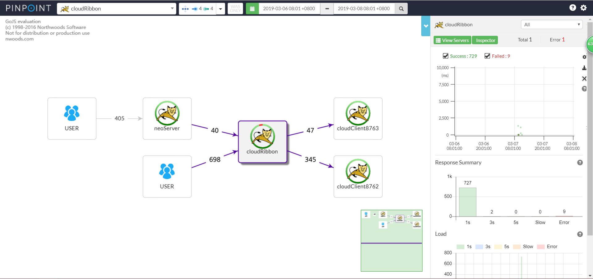


#### 1.查看调用关系

1.1 访问地址
1.2 选择应用

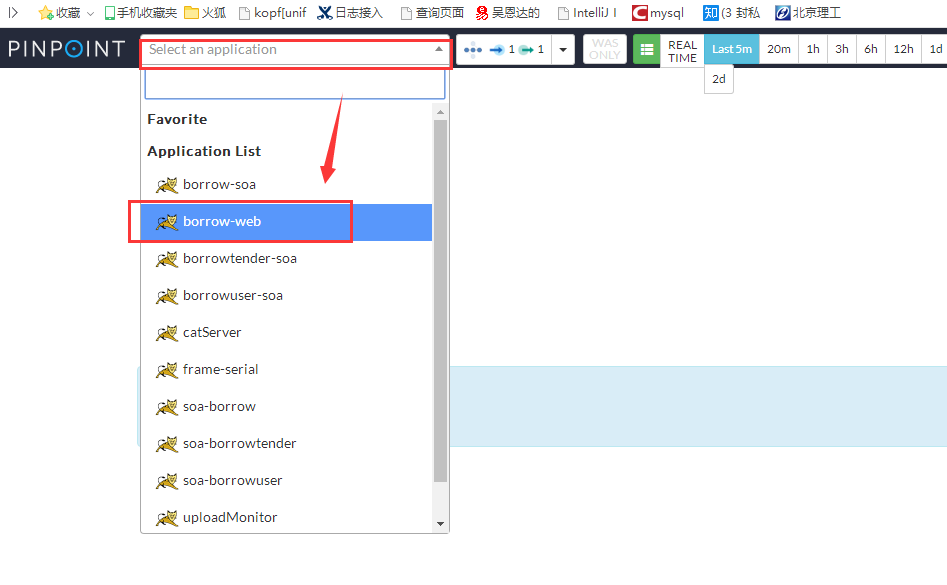

默认两层展示

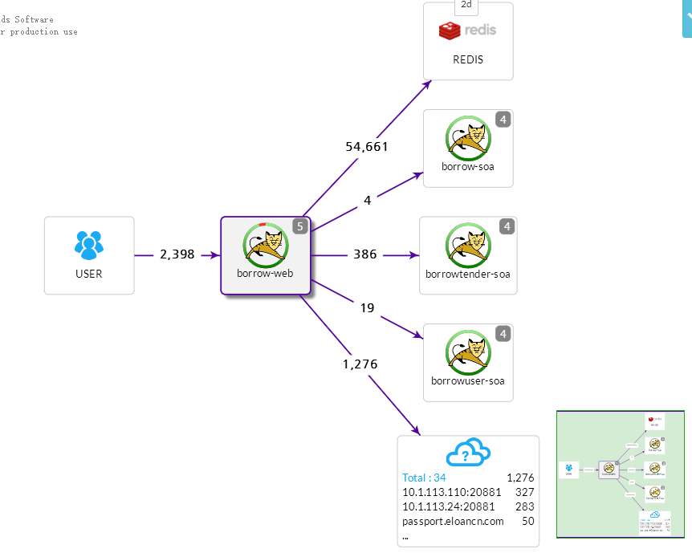

调整层级深度：

示例为前端调用4层追溯，后端调用4层追溯（4层为最深层级）

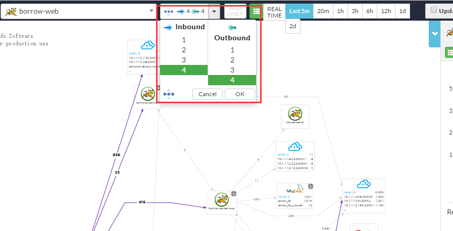

结果展示：

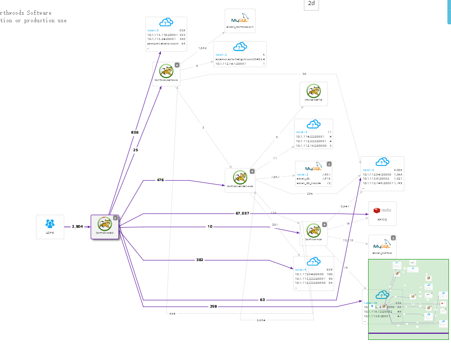

在图片内按鼠标滚轮调整图片大小。

连线上数字为调用次数

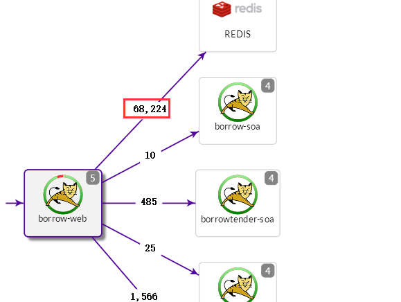

选择更多时间范围（默认最新5分钟）

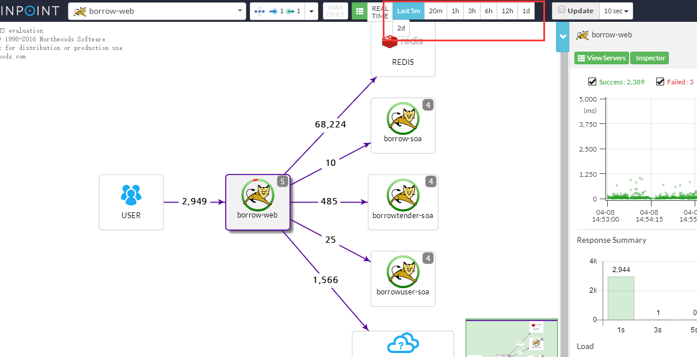

#### 2.查看调用链

鼠标按住右键，选中图中区域，松开右键，则展示选中时间段调用层级

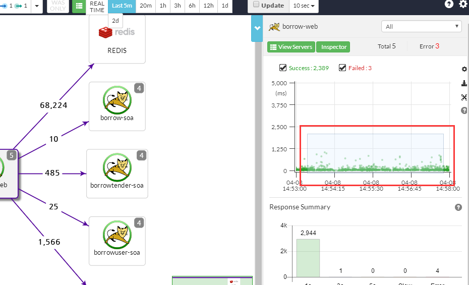

展示结果：


默认按耗时排序

选中某一调用，展示详细调用链及耗时

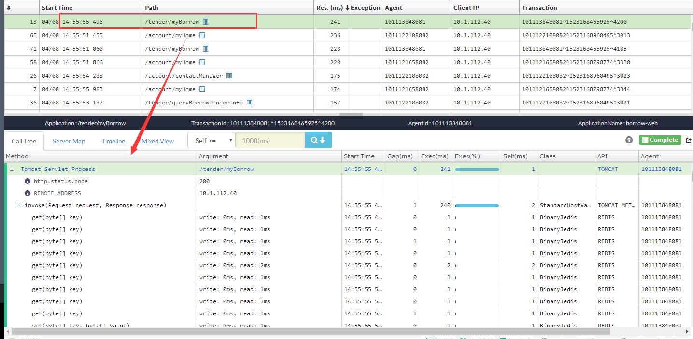

选中timelinetab可查看耗时情况：

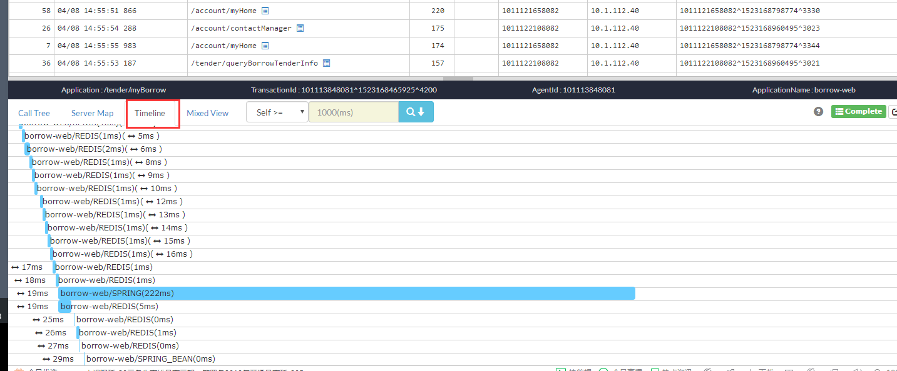

#### 3.查看错误信息

3.1 选择错误应用

机器应用抛出错误，机器应用会标红

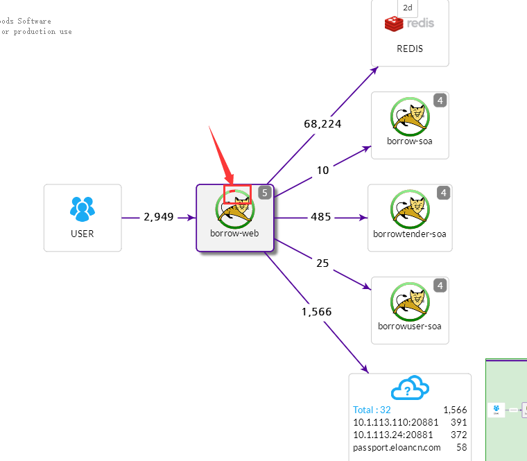


3.2 查看详细信息
选中应用，去除成功多选按钮选中对勾，按住鼠标右键，选中红点范围，松开鼠标右键，即可查看详细错误信息：

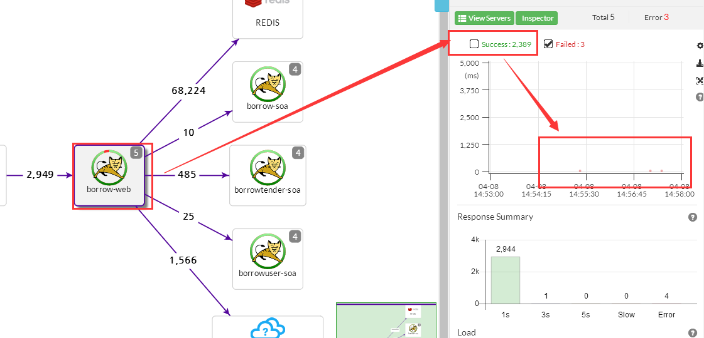

结果为：


选中某次错误请求，可在详细列表内找到详细错误信息

#### 4.查看应用情况

选中某一应用
单击inspector

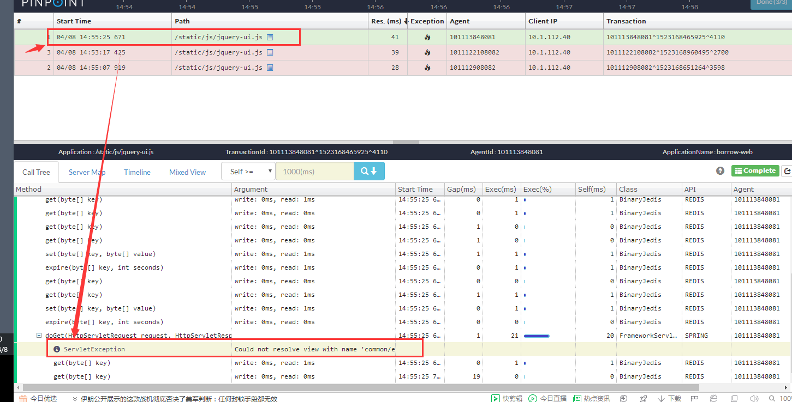


选中某一机器id，时间段，可展示jvm详细信息

其中内容包含：Jvm内存使用情况，Jvm永久带使用占用空间，Cpu使用情况，每秒处理的消息数（S标识操作系统，U标识此应用），Jvm线程情况，单请求平均响应时间等。

**参考文章**

https://www.cnblogs.com/yyhh/p/6106472.html

https://blog.csdn.net/heyeqingquan/article/details/74456591

