本文介绍如何将 Spring Boot 项目一键打包到远程 Docker 容器，然后通过运行一个镜像的方式来启动一个 Spring Boot 项目。

<!--more-->
参考 江南一点雨 [江南一点雨](javascript:void(0);)

### 1.准备工作

#### 1.1 准备 Docker

我这里以 CentOS7 为例来给大家演示。

首先需要在 CentOS7 上安装好 Docker，这个安装方式网上很多，我就不多说了。

默认情况下，Docker守护进程Unix socket（/var/run/docker.sock）来进行本地进程通信，而不会监听任何端口，因此只能在本地使用docker客户端或者使用Docker API进行操作。如果想在其他主机上操作Docker主机，就需要让Docker守护进程打开一个HTTP Socket，这样才能实现远程通信。

Docker 安装成功之后，我们首先需要修改 Docker 配置，开启允许远程访问 Docker 的功能，开启方式很简单，修改 `/usr/lib/systemd/system/docker.service` 文件，加入如下内容：

```
-H tcp://0.0.0.0:2375  -H unix:///var/run/docker.sock
```

如下图：

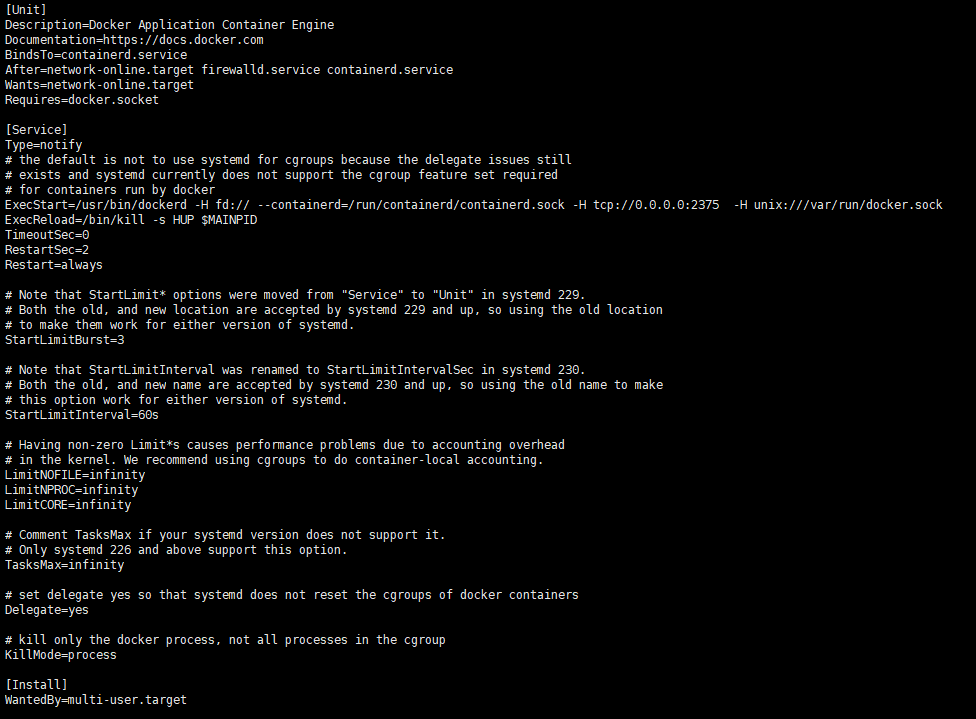

配置完成后，保存退出，然后重启 Docker：

```
systemctl daemon-reload
systemctl start docker
```

Docker 重启成功之后，Docker 的准备工作就算是 OK 了。

经过这里的时候我是遇到了很麻烦的问题 一直显示

Cannot connect to the Docker daemon at tcp://ip:2375. Is the docker daemon running?

???  我启动了啊 防火墙看了一下也是关的，为了确认 专门上腾讯云设置了一下安全组


然后跟着网上各种方法试，没办法了 重装 重整 。配置完之后还是不行，抱着试一试的态度看了一下防火墙

```
firewall-cmd --zone=public --add-port=2375/tcp --permanent
FirewallD is not running
systemctl start firewalld
```


这是个啥玩意  ！！！ 最后查到 这是因为进程被锁住了。

对它进行解锁就可以了。执行命令，即可实现取消服务的锁定 

```
systemctl unmask firewalld
```

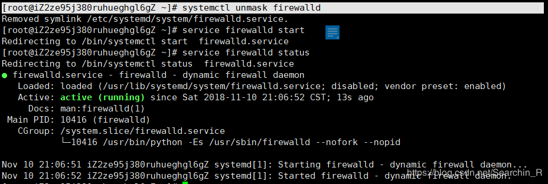

好了，现在防火墙已经重新启动了。 

注：下次需要锁定该服务时可以输入以下命令行执行

```
# systemctl mask firewalld
```

原来是这个原因  

重启之后 的测试方法：

通过接口获取所有的镜像:

```
curl 'http://111.231.110.198:2375/images/json?all=0'| python -m json.tool 
```

查看已经启动的容器信息：

```
curl http://111.231.110.198:2375/containers/json |python -m json.tool 
```

获取指定容器的具体信息：

```
curl -X GET 'http://111.231.110.198:2375/containers/e37e50e73bd4/json'|python -m json.tool 
```

启动指定容器：【此处使用容器别名】

```
curl -XPOST "http://192.168.18.54:2375/containers/t1/start" 
```

成功解决。

#### 1.2 准备 IDEA

IDEA 上的准备工作，主要是安装一个 Docker 插件，点击 `File->Settings->Plugins->Browse Repositories` 如下：

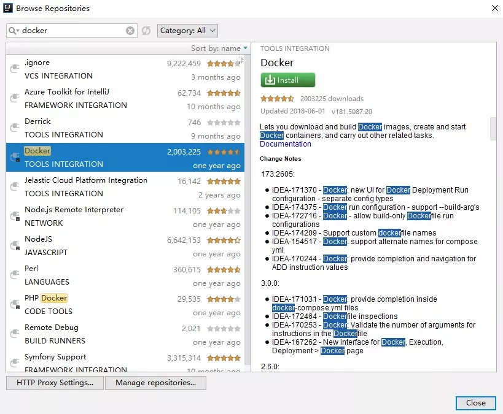

点击右边绿色的 Install 按钮，完成安装，安装完成之后需要重启一下 IDEA。

IDEA 重启成功之后，我们依次打开 `File->Settings->Build,Execution,Deployment->Docker` ，然后配置一下 Docker 的远程连接地址：

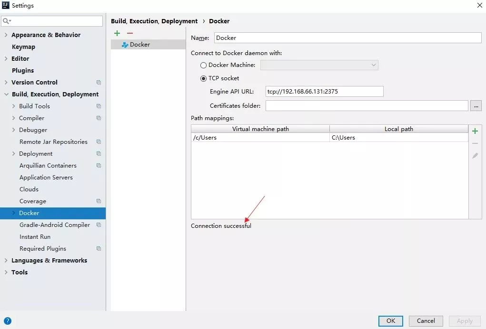

配置一下 Docker 的地址，配置完成后，可以看到下面有一个 Connection successful 提示，这个表示 Docker 已经连接上了。

如此之后，我们的准备工作就算是 OK 了。

### 2.准备项目

接下来我们来创建一个简单的 Spring Boot 项目（只需要引入 `spring-boot-starter-web` 依赖即可），项目创建成功之后，我们再创建一个普通的 `HelloDockerController`，用来做测试，如下：

```
@RestController
publicclass HelloDockerController {
    @GetMapping("/hello")
    public String hello() {
        return"hello docker!";
    }
}
```

这是一个很简单的接口，无需多说。

### 3.配置 Dockerfile

接下来，在项目的根目录下，我创建一个 Dockerfile ，作为我镜像的构建文件，具体位置如下图：

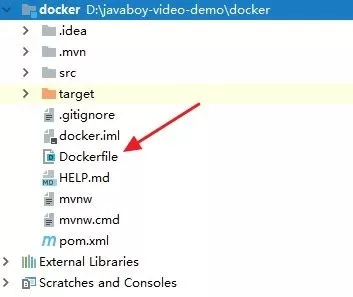

文件内容如下：

```
FROM hub.c.163.com/library/java:latest
VOLUME /tmp
ADD target/docker-0.0.1-SNAPSHOT.jar app.jar
ENTRYPOINT ["java","-jar","/app.jar"]
```

这里只有简单的四行，我说一下：

1. Spring Boot 项目的运行依赖 Java 环境，所以我自己的镜像基于 Java 镜像来构建。
2. 考虑到 Docker 官方镜像下载较慢，我这里使用了网易提供的 Docker 镜像。
3. 由于 Spring Boot 运行时需要 tmp 目录，这里数据卷配置一个 /tmp 目录出来。
4. 将本地 target 目录中打包好的 .jar 文件复制一份新的 到 /app.jar。
5. 最后就是配置一下启动命令，由于我打包的 jar 已经成为 app.jar 了，所以启动命令也是启动 app.jar。

这是我们配置的一个简单的 Dockerfile。

### 4.配置 Maven 插件

接下来在 pom.xml 文件中，添加如下插件：

```
<plugin>
    <groupId>com.spotify</groupId>
    <artifactId>docker-maven-plugin</artifactId>
    <version>1.2.0</version>
    <executions>
        <execution>
            <id>build-image</id>
            <phase>package</phase>
            <goals>
                <goal>build</goal>
            </goals>
        </execution>
    </executions>
    <configuration>
        <dockerHost>http://192.168.66.131:2375</dockerHost>
        <imageName>javaboy/${project.artifactId}</imageName>
        <imageTags>
            <imageTag>${project.version}</imageTag>
        </imageTags>
        <forceTags>true</forceTags>
        <dockerDirectory>${project.basedir}</dockerDirectory>
        <resources>
            <resource>
                <targetPath>/</targetPath>
                <directory>${project.build.directory}</directory>
                <include>${project.build.finalName}.jar</include>
            </resource>
        </resources>
    </configuration>
</plugin>
```

这个插件的配置不难理解：

1. 首先在 execution 节点中配置当执行 mvn package 的时候，顺便也执行一下 docker:build
2. 然后在 configuration 中分别配置 Docker 的主机地址，镜像的名称，镜像的 tags，其中 dockerDirectory 表示指定 Dockerfile 的位置。
3. 最后 resource 节点中再配置一下 jar 的位置和名称即可。

OK，做完这些我们就算大功告成了。

### 5.打包运行

接下来对项目进行打包，打包完成后，项目会自动构建成一个镜像，并且上传到 Docker 容器中，打包方式如下：

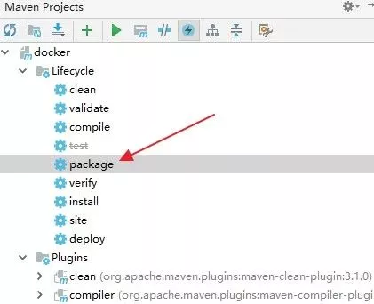

打包过程会稍微有一点旧，因为还包含了镜像的构建，特别是第一次打包，需要下载基础镜像，会更慢一些。

部分打包日志如下（项目构建过程）:

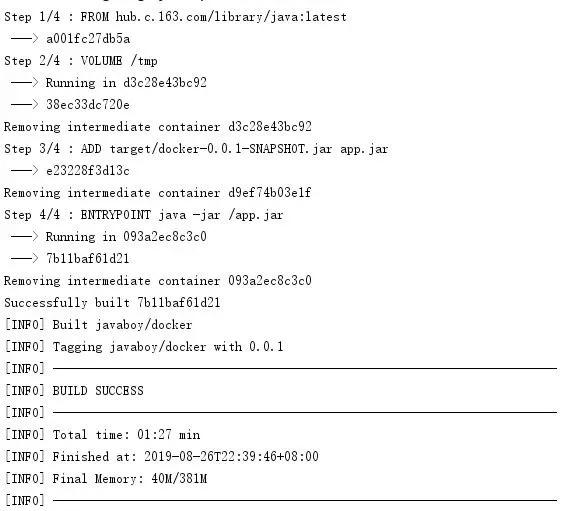

项目打包成功之后，我们就可以在 Docker 容器中看到我们刚刚打包成的镜像了，如下：


#### 5.1 运行方式一

此时，我们可以直接在 Linux 上像创建普通容器一样创建这个镜像的容器，然后启动，执行如下命令即可：

```
docker run -d --name javaboy -p 8080:8080 javaboy/docker:0.0.1
```

启动成功之后，我们就可以访问容器中的接口了。

但是这种操作显然还是有点麻烦，结合我们一开始安装的 Docker 插件，这个运行步骤还可以做进一步的简化。

#### 5.2 运行方式二

大家注意，此时我们的 IDEA 中多了一个选项，就是 docker，如下：


点击左边的绿色启动按钮，连接上 Docker 容器，连接成功之后，我们就可以看到目前 Docker 中的所有容器和镜像了，当然也包括我们刚刚创建的 Docker 镜像，如下：

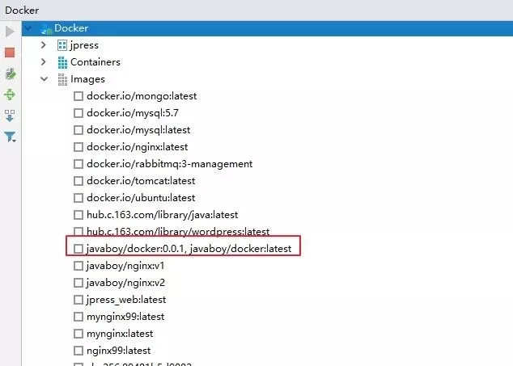

此时，我们选中这个镜像，右键单击，即可基于此镜像创建出一个容器，如下图：

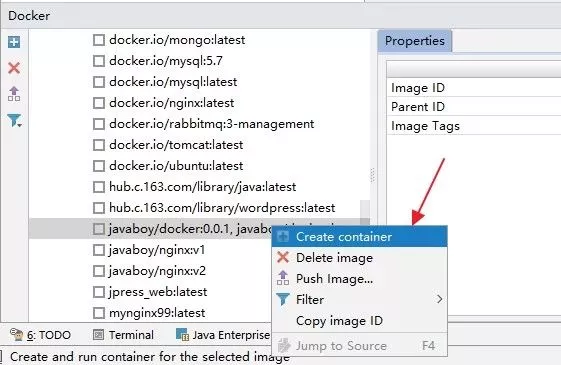

我们选择 Create container，然后填入容器的一些必要信息，配置一下容器名称，镜像 ID 会自动填上，暴露的端口使用 Specify 即可，然后写上端口的映射关系：

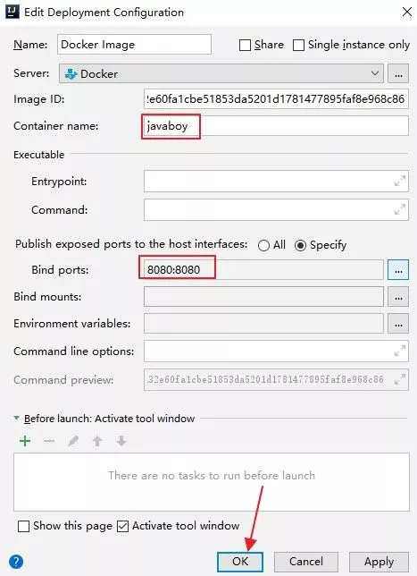

配置完成后，点击下方的 `run` 按钮，就可以开始运行了。运行日志如下：

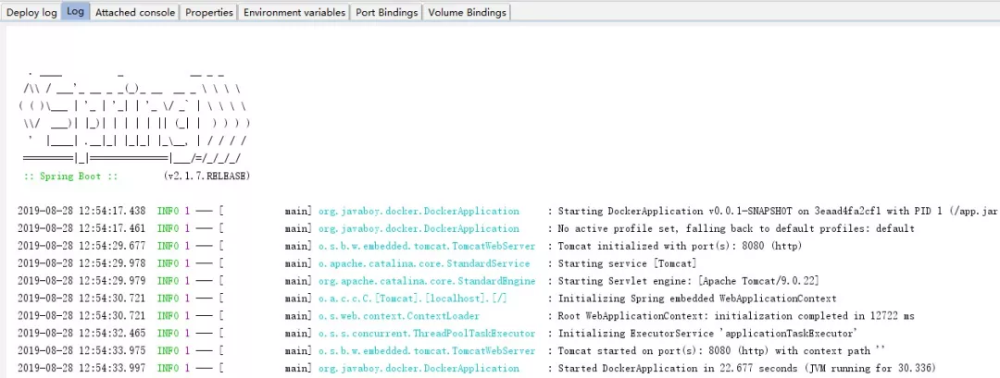

注意，这个日志是在 Docker 的那个窗口里打印出来的。

项目运行成功之后，在浏览器输入远程服务器的地址，就可以访问了：


如此之后，我们的 Spring Boot 项目就算顺利发布到远程 Docker 容器中了。
