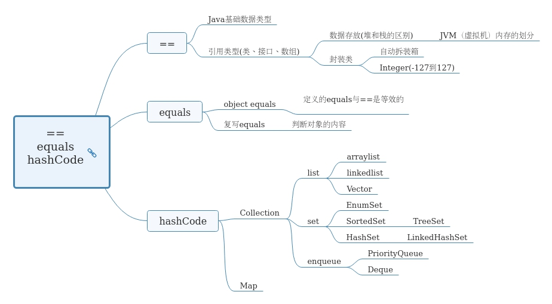

**面试整理**

<!--more-->

### hashCode和equals的区别

重写过 hashcode 和 equals 么，为什么重写equals时必须重写hashCode方法？equals和hashCode都是Object对象中的非final方法，它们设计的目的就是被用来覆盖(override)的，所以在程序设计中还是经常需要处理这两个方法。

> hashCode() 的作用是获取哈希码，也称为散列码；它实际上是返回一个int整数。这个哈希码的作用是确定该对象在哈希表中的索引位置。hashCode() 定义在JDK的Object.java中，这就意味着Java中的任何类都包含有hashCode() 函数。使用通过调用hashCode()方法获取对象的hash值。

想要明白hashCode的作用，必须要先知道Java中的集合。　　
 总的来说，Java中的集合（Collection）有两类，一类是List，再有一类是Set。前者集合内的元素是有序的，元素可以重复；后者元素无序，但元素不可重复。

那么这里就有一个比较严重的问题了：要想保证元素不重复，可两个元素是否重复应该依据什么来判断呢？

这就是Object.equals方法了。但是，如果每增加一个元素就检查一次，那么当元素很多时，后添加到集合中的元素比较的次数就非常多了。也就是说，如果集合中现在已经有1000个元素，那么第1001个元素加入集合时，它就要调用1000次equals方法。这显然会大大降低效率。
 于是，Java采用了哈希表的原理。

这样一来，当集合要添加新的元素时，

先调用这个元素的hashCode方法，就一下子能定位到它应该放置的物理位置上。

如果这个位置上没有元素，它就可以直接存储在这个位置上，不用再进行任何比较了；

如果这个位置上已经有元素了，就调用它的equals方法与新元素进行比较，相同的话就不存，不相同就散列其它的地址。所以这里存在一个冲突解决的问题。这样一来实际调用equals方法的次数就大大降低了，几乎只需要一两次。

> equals它的作用也是判断两个对象是否相等，如果对象重写了equals()方法，比较两个对象的内容是否相等；如果没有重写，比较两个对象的地址是否相同，价于“==”。同样的，equals()定义在JDK的Object.java中，这就意味着Java中的任何类都包含有equals()函数。object类中equals与==是等效的

### Java集合框架

分为三块：

**Set （集合）是无序、不可以重复的**

**List（列表）是有序、可以重复的**

**Map （映射）是键-值对：Map<key , value>**

分为三块：List列表、Set集合、Map映射

**Set、List和Map可以看做集合的三大类：**
**List集合是有序集合，集合中的元素可以重复，访问集合中的元素可以根据元素的索引来访问。**
**Set集合是无序集合，集合中的元素不可以重复，访问集合中的元素只能根据元素本身来访问（也是集合里元素不允许重复的原因）。**
**Map集合中保存Key-value对形式的元素，访问时只能根据每项元素的key来访问其value。** 

**List接口**
List接口继承于Collection接口，它可以定义一个**允许重复**的**有序集合**。因为List中的元素是有序的，所以我们可以通过使用索引（元素在List中的位置，类似于数组下标）来访问List中的元素，这类似于Java的数组。

List接口为Collection直接接口。List所代表的是**有序的Collection**，即它用某种特定的插入顺序来维护元素顺序。用户可以对列表中每个元素的插入位置进行精确地控制，同时可以根据元素的整数索引（在列表中的位置）访问元素，并搜索列表中的元素。实现List接口的集合主要有：ArrayList、LinkedList、Vector、Stack。

**Map一种映射，用于储存关系型数据，保存着两种值，一组用于保存key,另一组用来保存value。并且key不允许重复。** 
**HashMap底层就是一个数组，数组中根据存入的Key的HashCode决定存放位置，其Entry单元中有四个属性，分别为HashCode，Key，Vaule，和下一个Entry**，这样就形成了一个链表，当HashMap中的另一个拥有相同的HashCode值的不同的Key存入时，会将原来的Entry赋到新Entry的属性中，然后形成Entry链，查询的时候先比较HashCode，如果相同且Key值相同则直接取出，如果HashCode相同Key值不同则继续顺着链表寻找直到寻找到相同的Key值。 
TreeMap与HashMap的不同：表象上时TreeMap可以对Key进行排序，原因时TreeMap使用的时“红黑树”的二叉树结构储存Entry，也就是排序二叉树，左边恒放比此值小的数右边恒放比此值大的树，按照当前节点值与传入查询值的比较进行判断决定其存放位置/查询其数值； 
**Set集合**：Set与Map可以手动的互相转换 Set转换Map只需要新建一个对象，对象中又key和value两个属性，新建一个类继承Set存储新建的对象即可实现。Map转换为Set只需要将Map的Value固定，只使用Key存储数据即可实现； 
HashTable:Map的线程安全型号；

#### HashMap，HashTable底层实现的区别，hashTable和ConCurrentHashTable呢？

HashTable简单的理解就是hashmap的线程安全类 其方法大部分都相同只不过家了synchronize关键字保证其线程安全。其他的区别也有继承的接口不同这点。 
ConCurrentHashTable则是改进了hashtable的效率，hashtable虽然安全但是不能多线程同时操作，ConCurrentHashTable使用了分块的模式支持多线程操作，且使用了lock替换synchronize来提高了效率。